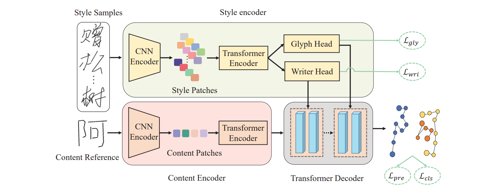
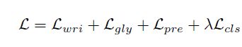

### 论文总体框架

```
SDT:
- a dual-head style encoder
- a content encoder
- a Transformer decoder

style encoder
    WriterNCE Lwri : 同一作者对于不同字的风格
    GlyphNCE Lgly : 同一个字不同作者的风格

content encoder:
    conv+
    ResNet18_Weights: 作为CNN的核心,核心学习特征Qmap (h ,w ,c(通道维度))

multi-layer transformer decoder:
    Lpre: 笔迹移动的Loss
    Lcls: 笔迹状态的Loss
```

总体架构



总体Loss



数据集

```text
由于我是下载的github开源的字体库的字体数据,我本地电脑和服务器有一份
总体来说训练数据产生步骤如下:
1.下载字体文件(来源网络)
2.将字体转化为坐标存储为pkl文件
3.将字体文字的图片转为pkl文件
4.指定要训练的文字存为pkl文件
好了,至此文件数据准备完毕
```

### create a test env

```shell
pip freeze > requirements.txt
conda create -n SDTLog python=3.10
conda activate SDTLog
pip install -r requirements.txt
```

### 继续训练

```text
假设要训练某个字体类似的样式的文字,下载好该字体文件
1.修改执行z_new_start/generate_utils/gen_coordinates_pkl.py获取coordinates的pkl,并且复制50份
2.修改执行z_new_start/generate_utils/gen_coordinates_pkl.py获取img的pkl,同复制50,注意对应名字需要和上面一样
3.上述文件coor和img分别上传至z_new_start/FontConfig.py里面指定的dev的z_coordinate_pkl_path,z_pic_pkl_path,修改其coors_pkl_path为现在的pkl
4.开始训练,可以调整FontConfig里面的训练步数,执行
python z_new_start/z_train.py --pretrained_model xx/xx.pth --dev
5.生成字体
python z_new_start/Generate.py --dev
6.获取到coor的pkl之后转为字体即可
```
