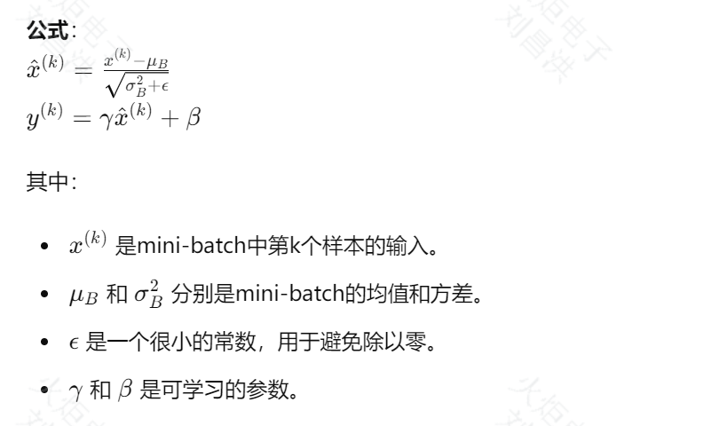
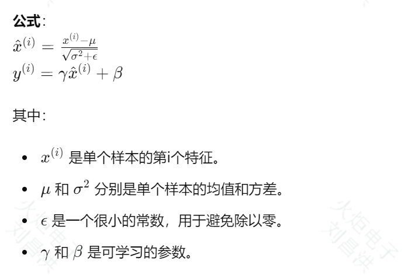

### 说明

```text
由于我是初学者,我很了解初学者什么都不懂,所以我把我的学习路程展示给大家,希望不要笑话我就可以了,XD
以下是我问gpt-4o的内容
```

---

在做transformer训练模型的时候,我的目录结构如下,我应该按照什么顺序写代码?

```structure
├── FontConfig.py
├── FontDataset.py
├── FontModel.py
└── FontTrainer.py
```

还有缺失的组件吗?

---

帮我完善以下字体训练的模型

```python
class FontModel(nn.Module):
    def __init__(self,
                 d_model=512,
                 num_head=8,
                 num_encoder_layers=2,
                 num_head_layers=1,
                 wri_decoder_layers=2,
                 gly_decoder_layers=2,
                 dim_feedforward=2048,  # 前馈神经网络中隐藏层的大小
                 dropout=0.1,
                 activation="relu",
                 normalize_before=True,  # 应用多头注意力和前馈神经网络之前是否对输入进行层归一化
                 ):
        super(FontModel, self).__init__()

    def forward(self, img):
        pass

    def inference(self):
        pass
```

---

1.对于以下2个输入图像的特征提取卷积层,哪个更好呢?
2.nn.Sequential 后面 * 是什么意思?

```python
        self.conv = nn.Sequential(
    nn.Conv2d(1, 64, kernel_size=3, stride=1, padding=1),
    nn.BatchNorm2d(64),
    nn.ReLU(inplace=True),
    nn.MaxPool2d(kernel_size=2, stride=2),
    nn.Conv2d(64, 128, kernel_size=3, stride=1, padding=1),
    nn.BatchNorm2d(128),
    nn.ReLU(inplace=True),
    nn.MaxPool2d(kernel_size=2, stride=2),
    nn.Conv2d(128, d_model, kernel_size=3, stride=1, padding=1),
    nn.BatchNorm2d(d_model),
    nn.ReLU(inplace=True)
)
```

```python
        # 此处使用一个卷积层和一个预训练的 ResNet-18 模型的特征提取器
self.Feat_Encoder = nn.Sequential(*(  # 一个输入通道，输出64个通道。卷积核大小为7，步长为2，填充为3。bias 设置为 False 表示不使用偏置项。
        [nn.Conv2d(1, 64, kernel_size=7, stride=2, padding=3, bias=False)]
        +
        # 获取了 ResNet-18 模型的子模块列表，然后去掉了列表的第一个和最后两个模块。
        # 这些被去掉的模块通常是 ResNet-18 模型的头部，包括全局平均池化层和全连接层。
        list(models.resnet18(weights=ResNet18_Weights.IMAGENET1K_V1).children())[1:-2]
))
```

---
帮我解释一下bias这儿的含义

```python
nn.Conv2d(1, 64, kernel_size=7, stride=2, padding=3, bias=False)
```

ans:
"""
bias 参数的含义
在卷积神经网络（CNN）中，每个卷积层的计算可以表示为：

output=(input ∗ filter) + bias
其中：
input 是输入张量。
filter 是卷积核（权重）。
bias 是一个可训练的偏置项。
如果 bias=True，则每个卷积核都有一个相应的偏置项bias，这个偏置项会加到卷积操作的结果上。
如果 bias=False，则卷积操作中不包含偏置项。

为什么选择 bias=False？
后续层有Batch Normalization：
通常在卷积层后面紧跟着使用批归一化层（BatchNorm），如：
nn.Conv2d(64, 128, kernel_size=3, stride=1, padding=1, bias=False),
nn.BatchNorm2d(128)
在这种情况下，偏置项的效果会被批归一化所抵消，因此可以去掉偏置项，减少参数数量和计算开销。
简化模型：
移除偏置项可以简化模型，减少需要训练的参数数量。
减少计算量：
尽管每个偏置项占用的计算资源较少，但在大模型中移除偏置项可以稍微减少计算量，尤其是在高效计算环境中。
总结
bias=False 表示在卷积操作中不使用偏置项。常见的理由包括后续使用批归一化层、简化模型以及减少计算量。具体是否使用偏置项，需要根据模型的设计和实际需求来决定。
"""

---

为什么kernel_size=7, stride=2, padding=3,这儿是怎么选取的呢?

```python
nn.Conv2d(1, 64, kernel_size=7, stride=2, padding=3, bias=False)
```

---

```python
class FontModel(nn.Module):
    def __init__(self,
                 d_model=512,
                 num_head=8,
                 num_encoder_layers=2,
                 num_head_layers=1,
                 wri_decoder_layers=2,
                 gly_decoder_layers=2,
                 dim_feedforward=2048,  # 前馈神经网络中隐藏层的大小
                 dropout=0.1,
                 activation="relu",
                 normalize_before=True,  # 应用多头注意力和前馈神经网络之前是否对输入进行层归一化
                 ):
        super(FontModel, self).__init__()

        self.Feat_Encoder = nn.Sequential(*(  # 一个输入通道，输出64个通道。卷积核大小为7，步长为2，填充为3。bias=False不使用偏置项
                [nn.Conv2d(1, 64, kernel_size=7, stride=2, padding=3, bias=False)]
                +
                list(models.resnet18(weights=ResNet18_Weights.IMAGENET1K_V1).children())[1:-2]
        ))

        # Transformer 编码器
        encoder_layers = TransformerEncoderLayer(d_model, num_head, dim_feedforward, dropout, activation)

```

```python
class TransformerEncoderLayer(nn.Module):

    def __init__(self,
                 d_model,
                 nhead,
                 dim_feedforward=2048,
                 dropout=0.1,
                 activation="relu",
                 normalize_before=False):
        super().__init__()
        self.self_attn = nn.MultiheadAttention(d_model, nhead, dropout=dropout)
        # Implementation of Feedforward model
        self.linear1 = nn.Linear(d_model, dim_feedforward)
        self.dropout = nn.Dropout(dropout)
        self.linear2 = nn.Linear(dim_feedforward, d_model)

        self.norm1 = nn.LayerNorm(d_model)
        self.norm2 = nn.LayerNorm(d_model)
        self.dropout1 = nn.Dropout(dropout)
        self.dropout2 = nn.Dropout(dropout)

        self.activation = _get_activation_fn(activation)
        self.normalize_before = normalize_before

    def with_pos_embed(self, tensor, pos: Optional[Tensor]):
        return tensor if pos is None else tensor + pos

    def forward_post(self,
                     src,
                     src_mask: Optional[Tensor] = None,
                     src_key_padding_mask: Optional[Tensor] = None,
                     pos: Optional[Tensor] = None):
        q = k = self.with_pos_embed(src, pos)
        src2 = self.self_attn(q, k, value=src, attn_mask=src_mask,
                              key_padding_mask=src_key_padding_mask)[0]
        src = src + self.dropout1(src2)
        src = self.norm1(src)
        src2 = self.linear2(self.dropout(self.activation(self.linear1(src))))
        src = src + self.dropout2(src2)
        src = self.norm2(src)
        return src

    def forward_pre(self, src,
                    src_mask: Optional[Tensor] = None,
                    src_key_padding_mask: Optional[Tensor] = None,
                    pos: Optional[Tensor] = None):
        src2 = self.norm1(src)
        q = k = self.with_pos_embed(src2, pos)
        src2 = self.self_attn(q, k, value=src2, attn_mask=src_mask,
                              key_padding_mask=src_key_padding_mask)[0]
        src = src + self.dropout1(src2)
        src2 = self.norm2(src)
        src2 = self.linear2(self.dropout(self.activation(self.linear1(src2))))
        src = src + self.dropout2(src2)
        return src

    def forward(self, src,
                src_mask: Optional[Tensor] = None,
                src_key_padding_mask: Optional[Tensor] = None,
                pos: Optional[Tensor] = None):
        if self.normalize_before:
            return self.forward_pre(src, src_mask, src_key_padding_mask, pos)
        return self.forward_post(src, src_mask, src_key_padding_mask, pos)
```

在这个模型中,TransformerEncoderLayer有自己写的如上,也有官方如下:
from torch.nn import TransformerEncoder, TransformerEncoderLayer, TransformerDecoder, TransformerDecoderLayer
那么我应该选取哪个呢?

---

```python
class TransformerEncoderLayer(nn.Module):

    def __init__(self,
                 d_model,
                 nhead,
                 dim_feedforward=2048,
                 dropout=0.1,
                 activation="relu",
                 normalize_before=False):
        super().__init__()
        self.self_attn = nn.MultiheadAttention(d_model, nhead, dropout=dropout)
        # Implementation of Feedforward model
        self.linear1 = nn.Linear(d_model, dim_feedforward)
        self.dropout = nn.Dropout(dropout)
        self.linear2 = nn.Linear(dim_feedforward, d_model)

        self.norm1 = nn.LayerNorm(d_model)
        self.norm2 = nn.LayerNorm(d_model)
        self.dropout1 = nn.Dropout(dropout)
        self.dropout2 = nn.Dropout(dropout)

        self.activation = _get_activation_fn(activation)
        self.normalize_before = normalize_before

    def with_pos_embed(self, tensor, pos: Optional[Tensor]):
        return tensor if pos is None else tensor + pos

    def forward_post(self,
                     src,
                     src_mask: Optional[Tensor] = None,
                     src_key_padding_mask: Optional[Tensor] = None,
                     pos: Optional[Tensor] = None):
        q = k = self.with_pos_embed(src, pos)
        src2 = self.self_attn(q, k, value=src, attn_mask=src_mask,
                              key_padding_mask=src_key_padding_mask)[0]
        src = src + self.dropout1(src2)
        src = self.norm1(src)
        src2 = self.linear2(self.dropout(self.activation(self.linear1(src))))
        src = src + self.dropout2(src2)
        src = self.norm2(src)
        return src

    def forward_pre(self, src,
                    src_mask: Optional[Tensor] = None,
                    src_key_padding_mask: Optional[Tensor] = None,
                    pos: Optional[Tensor] = None):
        src2 = self.norm1(src)
        q = k = self.with_pos_embed(src2, pos)
        src2 = self.self_attn(q, k, value=src2, attn_mask=src_mask,
                              key_padding_mask=src_key_padding_mask)[0]
        src = src + self.dropout1(src2)
        src2 = self.norm2(src)
        src2 = self.linear2(self.dropout(self.activation(self.linear1(src2))))
        src = src + self.dropout2(src2)
        return src

    def forward(self, src,
                src_mask: Optional[Tensor] = None,
                src_key_padding_mask: Optional[Tensor] = None,
                pos: Optional[Tensor] = None):
        if self.normalize_before:
            return self.forward_pre(src, src_mask, src_key_padding_mask, pos)
        return self.forward_post(src, src_mask, src_key_padding_mask, pos)
```

normalize_before=True的时候会
return self.forward_pre(src, src_mask, src_key_padding_mask, pos)
这是在做什么?

--- 
LayerNorm和BatchNorm是什么呢?到底

ans:

```text
Batch Normalization 在2015年由Sergey Ioffe和Christian Szegedy提出。
它通过对小批量数据（mini-batch）进行归一化处理来稳定和加速深度神经网络的训练。
主要步骤：
对每个mini-batch计算均值和方差。
将每个mini-batch内的激活值减去均值并除以标准差进行归一化。
引入两个可学习的参数，缩放参数 γ 和 平移参数 β，对归一化后的值进行线性变换，恢复网络的表达能力。
```



```text
Layer Normalization 是由Jimmy Ba和Diederik P. Kingma在2016年提出的一种归一化方法。
它在每个训练样本上进行归一化，而不是在mini-batch上进行归一化。
主要步骤：
对每个训练样本的所有特征计算均值和方差。
将每个训练样本的激活值减去均值并除以标准差进行归一化。
引入两个可学习的参数，缩放参数 γ 和 平移参数 β，对归一化后的值进行线性变换，恢复网络的表达能力。
```



```text
BatchNorm：主要用于CNN中，处理图像等数据的批量训练时效果显著。
LayerNorm：主要用于RNN和Transformer中，处理序列数据或需要逐样本归一化时效果更好。
```

---

```python
class FontModel(nn.Module):
    def __init__(self,
                 d_model=512,
                 num_head=8,
                 num_encoder_layers=2,
                 num_head_layers=1,
                 num_wri_decoder_layers=2,
                 num_gly_decoder_layers=2,
                 dim_feedforward=2048,  # 前馈神经网络中隐藏层的大小
                 dropout=0.1,
                 activation="relu",
                 normalize_before=True,  # 应用多头注意力和前馈神经网络之前是否对输入进行层归一化
                 ):
        super(FontModel, self).__init__()

        # 图像的特征提取卷积层
        # 此处使用一个卷积层和一个预训练的 ResNet-18 模型的特征提取器
        # *() 将列表中的元素作为多个参数传递给 nn.Sequential，而不是将整个列表作为一个参数
        self.Feat_Encoder = nn.Sequential(*(  # 一个输入通道，输出64个通道。卷积核大小为7，步长为2，填充为3。bias=False不使用偏置项
                [nn.Conv2d(1, 64, kernel_size=7, stride=2, padding=3, bias=False)]
                +
                # 获取了 ResNet-18 模型的子模块列表，然后去掉了列表的第一个和最后两个模块。
                # 这些被去掉的模块通常是 ResNet-18 模型的头部，包括全局平均池化层和全连接层。
                list(models.resnet18(weights=ResNet18_Weights.IMAGENET1K_V1).children())[1:-2]
        ))

        # Transformer 编码器
        encoder_layers = TransformerEncoderLayer(
            d_model, num_head, dim_feedforward, dropout, activation, normalize_before
        )
        self.base_encoder = TransformerEncoder(encoder_layers, num_encoder_layers)

        # 风格特征编码器
        writer_norm = nn.LayerNorm(d_model) if normalize_before else None
        glyph_norm = nn.LayerNorm(d_model) if normalize_before else None
        self.writer_encoder = TransformerEncoder(encoder_layers, num_head_layers, writer_norm)
        self.glyph_encoder = TransformerEncoder(encoder_layers, num_head_layers, glyph_norm)
```

```python
class TransformerEncoder(nn.Module):

    def __init__(self, encoder_layer, num_layers, norm=None):
        super().__init__()
        self.layers = _get_clones(encoder_layer, num_layers)
        self.num_layers = num_layers
        self.norm = norm
```

writer_encoder,glyph_encoder定义没理解,帮我细致解释一下

ans:

```text
TransformerEncoderLayer
这是一个Transformer编码器层，包括：
多头自注意力机制：允许模型关注输入序列的不同部分。
前馈神经网络：逐位置的全连接前馈网络。
层归一化和Dropout：用于稳定和正则化网络。

TransformerEncoder
这个类将多个TransformerEncoderLayer实例堆叠在一起：
layers：一个TransformerEncoderLayer实例的列表。
num_layers：编码器中的层数。
norm：可选的输出层归一化。
```

为什么在定义writer_encoder和glyph_encoder时使用了之前定义的encoder_layers?
而不是为每个编码器单独定义新的TransformerEncoderLayer。

---

```python
class Content_TR(nn.Module):
    def __init__(self,
                 d_model=256,
                 nhead=8,
                 num_encoder_layers=3,
                 dim_feedforward=2048,
                 dropout=0.1,
                 activation="relu",
                 normalize_before=True
                 ):
        super(Content_TR, self).__init__()
        self.Feat_Encoder = nn.Sequential(*(
                [nn.Conv2d(1, 64, kernel_size=7, stride=2, padding=3, bias=False)]
                +
                list(models.resnet18(weights=ResNet18_Weights.IMAGENET1K_V1).children())[1:-2]
        ))
        encoder_layer = TransformerEncoderLayer(
            d_model, nhead, dim_feedforward, dropout, activation, normalize_before
        )
        encoder_norm = nn.LayerNorm(d_model) if normalize_before else None
        self.add_position = PositionalEncoding(dropout=0.1, dim=d_model)
        self.encoder = TransformerEncoder(encoder_layer, num_encoder_layers, norm=encoder_norm)

    def forward(self, x):
        x = self.Feat_Encoder(x)
        x = rearrange(x, 'n c h w -> (h w) n c')
        x = self.add_position(x)
        x = self.encoder(x)
        return x
```

```python
class FontModel(nn.Module):
    def __init__(self,
                 d_model=512,
                 num_head=8,
                 num_encoder_layers=2,
                 num_writer_layers=1,
                 num_glyph_layers=1,
                 num_wri_decoder_layers=2,
                 num_gly_decoder_layers=2,
                 dim_feedforward=2048,  # 前馈神经网络中隐藏层的大小
                 dropout=0.1,
                 activation="relu",
                 normalize_before=True,  # 应用多头注意力和前馈神经网络之前是否对输入进行层归一化
                 ):
        super(FontModel, self).__init__()

        # 图像的特征提取卷积层
        # 此处使用一个卷积层和一个预训练的 ResNet-18 模型的特征提取器
        # *() 将列表中的元素作为多个参数传递给 nn.Sequential，而不是将整个列表作为一个参数
        self.Feat_Encoder = nn.Sequential(*(  # 一个输入通道，输出64个通道。卷积核大小为7，步长为2，填充为3。bias=False不使用偏置项
                [nn.Conv2d(1, 64, kernel_size=7, stride=2, padding=3, bias=False)]
                +
                # 获取了 ResNet-18 模型的子模块列表，然后去掉了列表的第一个和最后两个模块。
                # 这些被去掉的模块通常是 ResNet-18 模型的头部，包括全局平均池化层和全连接层。
                list(models.resnet18(weights=ResNet18_Weights.IMAGENET1K_V1).children())[1:-2]
        ))

        # Transformer 编码器
        encoder_layer = TransformerEncoderLayer(
            d_model, num_head, dim_feedforward, dropout, activation, normalize_before
        )
        self.base_encoder = TransformerEncoder(encoder_layer, num_encoder_layers)

        # 风格特征编码器
        writer_norm = nn.LayerNorm(d_model) if normalize_before else None
        glyph_norm = nn.LayerNorm(d_model) if normalize_before else None
        self.writer_encoder = TransformerEncoder(encoder_layer, num_writer_layers, writer_norm)
        self.glyph_encoder = TransformerEncoder(encoder_layer, num_glyph_layers, glyph_norm)

        # 内容编码器 用于对输入的内容进行编码，以提取内容信息。
        self.content_encoder = Content_TR(d_model, num_encoder_layers)
```

为什么还需要加一个content_encoder呢?

---

```python
class FontModel(nn.Module):
    def __init__(self,
                 d_model=512,
                 num_head=8,
                 num_encoder_layers=2,
                 num_writer_encoder_layers=1,
                 num_glyph_encoder_layers=1,
                 num_wri_decoder_layers=2,
                 num_gly_decoder_layers=2,
                 dim_feedforward=2048,  # 前馈神经网络中隐藏层的大小
                 dropout=0.1,
                 activation="relu",
                 normalize_before=True,  # 应用多头注意力和前馈神经网络之前是否对输入进行层归一化
                 return_intermediate_dec=True,  # 是否在解码过程中返回中间结果
                 ):
        super(FontModel, self).__init__()

        # 图像的特征提取卷积层
        # 此处使用一个卷积层和一个预训练的 ResNet-18 模型的特征提取器
        # *() 将列表中的元素作为多个参数传递给 nn.Sequential，而不是将整个列表作为一个参数
        self.feat_encoder = nn.Sequential(*(  # 一个输入通道，输出64个通道。卷积核大小为7，步长为2，填充为3。bias=False不使用偏置项
                [nn.Conv2d(1, 64, kernel_size=7, stride=2, padding=3, bias=False)]
                +
                # 获取了 ResNet-18 模型的子模块列表，然后去掉了列表的第一个和最后两个模块。
                # 这些被去掉的模块通常是 ResNet-18 模型的头部，包括全局平均池化层和全连接层。
                list(models.resnet18(weights=ResNet18_Weights.IMAGENET1K_V1).children())[1:-2]
        ))

        # Transformer 编码器
        encoder_layer = TransformerEncoderLayer(
            d_model, num_head, dim_feedforward, dropout, activation, normalize_before
        )
        self.base_encoder = TransformerEncoder(encoder_layer, num_encoder_layers)

        # 风格特征编码器
        writer_norm = nn.LayerNorm(d_model) if normalize_before else None
        glyph_norm = nn.LayerNorm(d_model) if normalize_before else None
        self.writer_encoder = TransformerEncoder(encoder_layer, num_writer_encoder_layers, writer_norm)
        self.glyph_encoder = TransformerEncoder(encoder_layer, num_glyph_encoder_layers, glyph_norm)

        # 内容编码器 用于对输入的内容进行编码，以提取内容信息。
        self.content_encoder = Content_TR(
            d_model=d_model, num_encoder_layers=num_encoder_layers
        )

        # 风格特征解码器
        writer_decoder_layers = TransformerDecoderLayer(
            d_model, num_head, dim_feedforward, dropout, activation
        )
        glyph_decoder_layers = TransformerDecoderLayer(
            d_model, num_head, dim_feedforward, dropout, activation
        )
        self.writer_transformer_decoder = TransformerDecoder(
            writer_decoder_layers, num_wri_decoder_layers
        )
        self.glyph_transformer_decoder = TransformerDecoder(
            glyph_decoder_layers, num_gly_decoder_layers
        )
```

为什么在定义writer_encoder和glyph_encoder时使用了之前定义的encoder_layers?
解码器这儿却每个都有自己的呢?

---

```python
self.pro_mlp_writer = nn.Sequential(
    nn.Linear(512, 4096),
    nn.GELU(),
    nn.Linear(4096, 256)
)
self.pro_mlp_character = nn.Sequential(
    nn.Linear(512, 4096),
    nn.GELU(),
    nn.Linear(4096, 256)
)
```

这个有什么作用呢?

---

如果增加了这个多层感知器,还需要增加self.fc_out = nn.Linear(d_model, 256) 吗?

---
这个写法如果展开是什么呢?

```python
self.pro_mlp_writer = nn.Sequential(
    nn.Linear(512, 4096),
    nn.GELU(),
    nn.Linear(4096, 256)
)
```

ans:
"""
展开后的写法将每一层单独定义，并在 forward 方法中显式调用：
class FontModel(nn.Module):
def __init__(self, d_model=512, ...):
super(FontModel, self).__init__()
...

# 定义各个层

self.fc1 = nn.Linear(512, 4096)
self.gelu = nn.GELU()
self.fc2 = nn.Linear(4096, 256)
...

    def forward(self, x):
        ...
        # 显式调用每一层
        x = self.fc1(x)
        x = self.gelu(x)
        writer_features = self.fc2(x)
        ...
        return writer_features
        ...

"""

---

```python
class SeqtoEmb(nn.Module):
    def __init__(self, input_dim, dropout=0.1):
        super().__init__()
        self.fc_1 = nn.Linear(5, 256)
        self.fc_2 = nn.Linear(256, input_dim)
        self.dropout = nn.Dropout(dropout)

    def forward(self, seq):
        x = self.dropout(torch.relu(self.fc_1(seq)))
        x = self.fc_2(x)
        return x


class EmbtoSeq(nn.Module):
    def __init__(self, input_dim, dropout=0.1):
        super().__init__()
        self.fc_1 = nn.Linear(input_dim, 256)
        self.fc_2 = nn.Linear(256, 123)
        self.dropout = nn.Dropout(dropout)

    def forward(self, seq):
        x = self.dropout(torch.relu(self.fc_1(seq)))
        x = self.fc_2(x)
        return x
```

下面2个模块有什么用?
self.SeqtoEmb = SeqtoEmb(input_dim=d_model)
self.EmbtoSeq = EmbtoSeq(input_dim=d_model)

---

```python
class FontModel(nn.Module):
    def __init__(self,
                 d_model=512,
                 num_head=8,
                 num_encoder_layers=2,
                 num_writer_encoder_layers=1,
                 num_glyph_encoder_layers=1,
                 num_wri_decoder_layers=2,
                 num_gly_decoder_layers=2,
                 dim_feedforward=2048,  # 前馈神经网络中隐藏层的大小
                 dropout=0.1,
                 activation="relu",
                 normalize_before=True,  # 应用多头注意力和前馈神经网络之前是否对输入进行层归一化
                 return_intermediate_dec=True,  # 是否在解码过程中返回中间结果
                 ):
        super(FontModel, self).__init__()

        # 图像的特征提取卷积层
        # 此处使用一个卷积层和一个预训练的 ResNet-18 模型的特征提取器
        # *() 将列表中的元素作为多个参数传递给 nn.Sequential，而不是将整个列表作为一个参数
        self.feat_encoder = nn.Sequential(*(  # 一个输入通道，输出64个通道。卷积核大小为7，步长为2，填充为3。bias=False不使用偏置项
                [nn.Conv2d(1, 64, kernel_size=7, stride=2, padding=3, bias=False)]
                +
                # 获取了 ResNet-18 模型的子模块列表，然后去掉了列表的第一个和最后两个模块。
                # 这些被去掉的模块通常是 ResNet-18 模型的头部，包括全局平均池化层和全连接层。
                list(models.resnet18(weights=ResNet18_Weights.IMAGENET1K_V1).children())[1:-2]
        ))

        # Transformer 编码器
        encoder_layer = TransformerEncoderLayer(
            d_model, num_head, dim_feedforward, dropout, activation, normalize_before
        )
        self.base_encoder = TransformerEncoder(encoder_layer, num_encoder_layers)

        # 风格特征编码器
        writer_norm = nn.LayerNorm(d_model) if normalize_before else None
        glyph_norm = nn.LayerNorm(d_model) if normalize_before else None
        self.writer_encoder = TransformerEncoder(encoder_layer, num_writer_encoder_layers, writer_norm)
        self.glyph_encoder = TransformerEncoder(encoder_layer, num_glyph_encoder_layers, glyph_norm)

        # 内容编码器 用于对输入的内容进行编码，以提取内容信息。
        self.content_encoder = Content_TR(
            d_model=d_model, num_encoder_layers=num_encoder_layers
        )

        # 风格特征解码器
        writer_decoder_layers = TransformerDecoderLayer(
            d_model, num_head, dim_feedforward, dropout, activation
        )
        glyph_decoder_layers = TransformerDecoderLayer(
            d_model, num_head, dim_feedforward, dropout, activation
        )
        self.writer_transformer_decoder = TransformerDecoder(
            writer_decoder_layers, num_wri_decoder_layers
        )
        self.glyph_transformer_decoder = TransformerDecoder(
            glyph_decoder_layers, num_gly_decoder_layers
        )

        self.pro_mlp_writer = nn.Sequential(
            nn.Linear(512, 4096),
            nn.GELU(),
            nn.Linear(4096, 256)
        )
        self.pro_mlp_character = nn.Sequential(
            nn.Linear(512, 4096),
            nn.GELU(),
            nn.Linear(4096, 256)
        )

        self.SeqtoEmb = SeqtoEmb(output_dim=d_model)
        self.EmbtoSeq = EmbtoSeq(input_dim=d_model)
        self.add_position = PositionalEncoding(dim=d_model, dropout=0.1)
        # 参数重置 用于初始化模型的参数
        self._reset_parameters()

    def _reset_parameters(self):
        for p in self.parameters():
            if p.dim() > 1:
                nn.init.xavier_uniform_(p)
```

在FontModel模型的定义中,self._reset_parameters()有必要吗?他这句话在什么时候执行呢?

ans:
"""
在 FontModel 的构造函数 __init__ 中，
self._reset_parameters() 会在所有层和模块定义完成后立即执行。
这是因为构造函数会在创建 FontModel 对象时自动调用，确保模型参数在模型创建时被正确初始化。
执行流程:
调用构造函数: 创建 FontModel 对象时，例如 model = FontModel()，会调用 __init__ 方法。
定义模型结构: __init__ 方法定义模型的所有层和模块，包括卷积层、Transformer 编码器和解码器等。
初始化参数: 定义完成后，self._reset_parameters() 被调用，以便为模型中的所有参数执行初始化。
"""

--- 

帮我就FontModel写一下forward方法

ans:

```python
def forward(self, image, writer_style, content_seq):
    # 提取图像特征
    feat = self.feat_encoder(image)
    feat = feat.flatten(2).permute(2, 0, 1)  # (batch_size, channels, H, W) -> (H*W, batch_size, channels)

    # Transformer编码器处理图像特征
    encoded_feat = self.base_encoder(feat)

    # 编码风格特征
    writer_feat = self.writer_encoder(writer_style)
    glyph_feat = self.glyph_encoder(encoded_feat)

    # 编码内容
    content_feat = self.content_encoder(content_seq)

    # 解码风格特征和内容特征
    writer_decoded = self.writer_transformer_decoder(content_feat, writer_feat)
    glyph_decoded = self.glyph_transformer_decoder(content_feat, glyph_feat)

    # 多层感知器处理
    writer_output = self.pro_mlp_writer(writer_decoded)
    character_output = self.pro_mlp_character(glyph_decoded)

    return writer_output, character_output
```

评价:似乎完全不对,我是不是该先写数据加载之后,在考虑这个呢?

--- 

```python
class FontModel(nn.Module):
    def __init__(self,
                 d_model=512,
                 num_head=8,
                 num_encoder_layers=2,
                 num_writer_encoder_layers=1,
                 num_glyph_encoder_layers=1,
                 num_wri_decoder_layers=2,
                 num_gly_decoder_layers=2,
                 dim_feedforward=2048,  # 前馈神经网络中隐藏层的大小
                 dropout=0.1,
                 activation="relu",
                 normalize_before=True,  # 应用多头注意力和前馈神经网络之前是否对输入进行层归一化
                 return_intermediate_dec=True,  # 是否在解码过程中返回中间结果
                 ):
        super(FontModel, self).__init__()

        # 图像的特征提取卷积层
        # 此处使用一个卷积层和一个预训练的 ResNet-18 模型的特征提取器
        # *() 将列表中的元素作为多个参数传递给 nn.Sequential，而不是将整个列表作为一个参数
        self.feat_encoder = nn.Sequential(*(  # 一个输入通道，输出64个通道。卷积核大小为7，步长为2，填充为3。bias=False不使用偏置项
                [nn.Conv2d(1, 64, kernel_size=7, stride=2, padding=3, bias=False)]
                +
                # 获取了 ResNet-18 模型的子模块列表，然后去掉了列表的第一个和最后两个模块。
                # 这些被去掉的模块通常是 ResNet-18 模型的头部，包括全局平均池化层和全连接层。
                list(models.resnet18(weights=ResNet18_Weights.IMAGENET1K_V1).children())[1:-2]
        ))

        # Transformer 编码器
        encoder_layer = TransformerEncoderLayer(
            d_model, num_head, dim_feedforward, dropout, activation, normalize_before
        )
        self.base_encoder = TransformerEncoder(encoder_layer, num_encoder_layers)

        # 风格特征编码器
        writer_norm = nn.LayerNorm(d_model) if normalize_before else None
        glyph_norm = nn.LayerNorm(d_model) if normalize_before else None
        self.writer_encoder = TransformerEncoder(
            encoder_layer, num_writer_encoder_layers, writer_norm
        )
        self.glyph_encoder = TransformerEncoder(
            encoder_layer, num_glyph_encoder_layers, glyph_norm
        )

        # 内容编码器 用于对输入的内容进行编码，以提取内容信息。
        self.content_encoder = Content_TR(
            d_model=d_model, num_encoder_layers=num_encoder_layers
        )

        # 风格特征解码器
        writer_decoder_layers = TransformerDecoderLayer(
            d_model, num_head, dim_feedforward, dropout, activation
        )
        glyph_decoder_layers = TransformerDecoderLayer(
            d_model, num_head, dim_feedforward, dropout, activation
        )
        self.writer_transformer_decoder = TransformerDecoder(
            writer_decoder_layers, num_wri_decoder_layers
        )
        self.glyph_transformer_decoder = TransformerDecoder(
            glyph_decoder_layers, num_gly_decoder_layers
        )

        # 多层感知器（MLP，Multi-Layer Perceptron)
        # Gaussian Error Linear Unit
        self.pro_mlp_writer = nn.Sequential(
            nn.Linear(512, 4096),
            nn.GELU(),
            nn.Linear(4096, 256)
        )
        self.pro_mlp_character = nn.Sequential(
            nn.Linear(512, 4096),
            nn.GELU(),
            nn.Linear(4096, 256)
        )

        # 序列到emb (SeqtoEmb) 和 emb到序列 (EmbtoSeq)
        # 这两个模块用于处理序列数据和嵌入数据之间的转换。
        self.SeqtoEmb = SeqtoEmb(output_dim=d_model)
        self.EmbtoSeq = EmbtoSeq(input_dim=d_model)
        self.add_position = PositionalEncoding(dim=d_model, dropout=0.1)
        # 参数重置 用于初始化模型的参数
        self._reset_parameters()
```

num_writer_encoder_layers=1,
num_glyph_encoder_layers=1,
num_wri_decoder_layers=2,
num_gly_decoder_layers=2,
encode是1,decode是2,没问题吗?


---

```python
transform_data = transforms.Compose([
    transforms.ToTensor(),
    transforms.Normalize(mean=(0.5), std=(0.5))
])


class FontDataset(Dataset):
    def __init__(self, image_dir, transform=None):
        self.image_dir = image_dir
        self.transform = transform
        self.image_paths = [os.path.join(image_dir, f) for f in os.listdir(image_dir) if f.endswith('.png')]

    def __len__(self):
        return len(self.image_paths)

    def __getitem__(self, idx):
        pass
```

为什么需要transforms.Compose这儿呢?理解不了

ans:
"""
用于将多个图像变换操作（transforms）组合在一起，以便在加载图像数据时一次性应用这些变换。
具体来说，它的作用是在 FontDataset 类加载图像时，对图像进行预处理

transforms.Compose 接受一个列表，列表中的每个元素都是一个图像变换操作。
这些操作会按顺序依次应用到图像上。你指定了两个变换操作：
1.transforms.ToTensor()
这个操作将图像从 PIL Image 或 numpy ndarray 转换为 PyTorch 的 Tensor。
图像数据通常是一个形状为 (H, W, C) 的数组，H 是高度，W 是宽度，C 是通道数（通常为3，即RGB图像）。
ToTensor() 会将这个数组转换为一个形状为 (C, H, W) 的 Tensor，并且将像素值从 [0, 255] 范围缩放到 [0.0, 1.0] 范围。
2.transforms.Normalize(mean, std)
这个操作会对 Tensor 进行标准化，使其具有给定的均值 (mean) 和标准差 (std)。
标准化公式为：(image - mean) / std。
mean 和 std 都是 (0.5)，意味着假设输入图像的每个通道的像素值在 [-1, 1] 范围内
（因为 ToTensor() 将像素值从 [0, 255] 缩放到了 [0.0, 1.0]，然后标准化后的范围是 [-1, 1]）。

为什么需要 transforms.Compose？
在 FontDataset 类中，会在 __getitem__ 方法中使用 self.transform 对加载的图像进行预处理。
如果没有 transforms.Compose，就需要手动逐一应用这些变换操作。
transforms.Compose 简化了这一过程，将多个变换组合在一起，以便在数据加载时一次性应用

```python
def __getitem__(self, idx):
    img_path = self.image_paths[idx]
    image = Image.open(img_path)
    if self.transform:
        image = self.transform(image)
    return image
```

"""


---

```python
train_dataset = ScriptDataset(
    cfg.DATA_LOADER.PATH, cfg.DATA_LOADER.DATASET, cfg.TRAIN.ISTRAIN, cfg.MODEL.NUM_IMGS
)
train_loader = torch.utils.data.DataLoader(
    train_dataset,
    batch_size=cfg.TRAIN.IMS_PER_BATCH,
    shuffle=True,
    drop_last=False,
    collate_fn=train_dataset.collate_fn_,
    num_workers=cfg.DATA_LOADER.NUM_THREADS
)
```

ScriptDataset的collate_fn_定义

```python
    def collate_fn_(self, batch_data):


    bs = len(batch_data)
# 找到 batch 中最长的序列长度，并加1（因为需要在末尾填充一个结束状态）
max_len = max([s['coords'].shape[0] for s in batch_data]) + 1
output = {'coords': torch.zeros((bs, max_len, 5)),  # (batch_size, max_len, 5)的张量，表示每个样本的坐标和状态
          # (x, y, state_1, state_2, state_3)==> (x,y,pen_down,pen_up,pen_end) 下笔、提笔、终止
          'coords_len': torch.zeros((bs,)),  # 每个样本的实际长度
          'character_id': torch.zeros((bs,)),
          'writer_id': torch.zeros((bs,)),
          'img_list': [],
          'char_img': [],
          'img_label': []}
# 将所有未使用的空间填充为结束状态
output['coords'][:, :, -1] = 1  # 用笔的结束状态填充

for i in range(bs):
    s = batch_data[i]['coords'].shape[0]
    output['coords'][i, :s] = batch_data[i]['coords']  # 填充当前样本的坐标和状态
    output['coords'][i, 0, :2] = 0  # 在第一个token处放置下笔状态
    output['coords_len'][i] = s
    output['character_id'][i] = batch_data[i]['character_id']
    output['writer_id'][i] = batch_data[i]['writer_id']
    output['img_list'].append(batch_data[i]['img_list'])
    output['char_img'].append(batch_data[i]['char_img'])
    output['img_label'].append(batch_data[i]['img_label'])
output['img_list'] = torch.stack(output['img_list'], 0)  # -> (B, num_img, 1, H, W)
temp = torch.stack(output['char_img'], 0)
output['char_img'] = temp.unsqueeze(1)
output['img_label'] = torch.cat(output['img_label'], 0)
output['img_label'] = output['img_label'].view(-1, 1).squeeze()
return output
```

collate_fn_有什么用?

ans:
"""
collate_fn_ 在 PyTorch 数据加载器 (DataLoader) 中用于处理和组合批次数据。
在数据集从 Dataset 类中读取样本后，DataLoader 会将这些样本组织成批次，
以便送入模型进行训练或推理。collate_fn_ 函数的作用是定义如何将一批样本组合成一个批次

填充序列：由于样本的序列长度不一致，collate_fn_ 会找到批次中最长的序列长度，
并将所有序列填充到这个长度。这是为了保证所有样本在同一个批次中具有相同的维度，便于批量计算。
初始化输出张量：collate_fn_ 会初始化一个输出字典， 用于存储组合后的批次数据。
这个字典包括坐标和状态 (coords)、样本实际长度 (coords_len)、字符 ID (character_id)、作者 ID (writer_id)、图片列表 (img_list)
、字符图片 (char_img)、图片标签 (img_label) 等信息。
填充数据：collate_fn_ 会将每个样本的数据填充到初始化的张量中。
如果样本长度不足，则用特殊标记（例如笔的结束状态）进行填充。
同时，collate_fn_ 还会对一些特定位置的值进行处理，如在第一个 token 处放置下笔状态。
处理列表数据：collate_fn_ 会将批次中的列表数据（如图片列表和字符图片）进行堆叠和调整，
以便组合成一个批次。
返回批次数据：最终，collate_fn_ 会返回组合好的批次数据，供模型训练或推理使用。
当迭代 train_loader 时，DataLoader 会自动处理从数据集中取出的样本，并通过 collate_fn_ 组合这些样本，形成一个个批次供模型使用
"""

---

DTW指标是什么意思?

ans:
"""
动态时间规整（Dynamic Time Warping，DTW）是一种衡量时间序列相似性的重要方法。它特别适用于比较长度不同的时间序列，通过动态调整时间轴上的点匹配来最小化时间序列之间的距离。

DTW指标的具体含义如下：

距离度量：DTW通过比较两个时间序列中的各个点，计算它们之间的距离，并找到一种匹配方式，使得总距离最小化。这个总距离就是DTW指标，用于衡量两个时间序列的相似性。

时间轴对齐：不同于欧几里得距离等常规方法，DTW允许对时间轴进行非线性变形，从而更好地对齐时间序列的特征。例如，在语音识别中，DTW可以对齐说话速度不同的两个语音序列。

灵活性：DTW在处理时间序列长度不一致、速度变化、和噪声等方面具有很大的灵活性。这使得它在语音识别、手写字符识别、医学信号分析等领域得到了广泛应用。

计算复杂性：尽管DTW的计算复杂度相对较高，尤其是对长序列，但通过改进算法和使用动态规划技术，计算效率得到了显著提升。

在模型训练中，使用DTW指标可以帮助评估生成结果与目标序列之间的相似性。具体来说，生成结果的DTW指标越低，表明生成序列与目标序列越相似，从而反映出模型的生成质量越高。
"""

---

```python
class SDT_Generator(nn.Module):

    def __init__(self,
                 d_model=512,
                 nhead=8,
                 num_encoder_layers=2,
                 num_head_layers=1,
                 wri_dec_layers=2,
                 gly_dec_layers=2,
                 dim_feedforward=2048,
                 dropout=0.1,
                 activation="relu",
                 normalize_before=True,
                 return_intermediate_dec=True):
        super(SDT_Generator, self).__init__()

        self.Feat_Encoder = nn.Sequential(*(  # 一个输入通道，输出64个通道。卷积核大小为7，步长为2，填充为3。bias 设置为 False 表示不使用偏置项。
                [nn.Conv2d(1, 64, kernel_size=7, stride=2, padding=3, bias=False)]
                +
                # 获取了 ResNet-18 模型的子模块列表，然后去掉了列表的第一个和最后两个模块。
                # 这些被去掉的模块通常是 ResNet-18 模型的头部，包括全局平均池化层和全连接层。
                # 从列表的第二个元素开始，一直到倒数第三个元素结束，不包括这两个元素
                list(models.resnet18(weights=ResNet18_Weights.IMAGENET1K_V1).children())[1:-2]
        ))
        encoder_layer = TransformerEncoderLayer(
            d_model, nhead, dim_feedforward, dropout, activation, normalize_before
        )
        # Transformer 编码器 用于对输入的特征进行编码，以提取全局的风格信息。
        self.base_encoder = TransformerEncoder(encoder_layer, num_encoder_layers, None)
        writer_norm = nn.LayerNorm(d_model) if normalize_before else None
        glyph_norm = nn.LayerNorm(d_model) if normalize_before else None
        # Writer Head 和 Glyph Head: 这两个头部分别用于提取作者风格和字符风格。
        # 它们使用相同的 Transformer 编码器层，但可以有不同的层数。
        self.writer_head = TransformerEncoder(encoder_layer, num_head_layers, writer_norm)
        self.glyph_head = TransformerEncoder(encoder_layer, num_head_layers, glyph_norm)

        # content encoder
        # 内容编码器 用于对输入的内容进行编码，以提取内容信息。
        self.content_encoder = Content_TR(d_model=d_model, num_encoder_layers=num_encoder_layers)

        # decoder for receiving writer-wise and character-wise styles
        decoder_layer = TransformerDecoderLayer(
            d_model, nhead, dim_feedforward, dropout, activation, normalize_before
        )
        wri_decoder_norm = nn.LayerNorm(d_model) if normalize_before else None
        self.wri_decoder = TransformerDecoder(
            decoder_layer, wri_dec_layers, wri_decoder_norm, return_intermediate=return_intermediate_dec
        )
        gly_decoder_norm = nn.LayerNorm(d_model) if normalize_before else None
        self.gly_decoder = TransformerDecoder(
            decoder_layer, gly_dec_layers, gly_decoder_norm, return_intermediate=return_intermediate_dec
        )

        self.pro_mlp_writer = nn.Sequential(
            nn.Linear(512, 4096),
            nn.GELU(),
            nn.Linear(4096, 256)
        )
        self.pro_mlp_character = nn.Sequential(
            nn.Linear(512, 4096),
            nn.GELU(),
            nn.Linear(4096, 256)
        )

        self.SeqtoEmb = SeqtoEmb(output_dim=d_model)
        self.EmbtoSeq = EmbtoSeq(input_dim=d_model)
        self.add_position = PositionalEncoding(dropout=0.1, dim=d_model)
        # 参数重置 用于初始化模型的参数
        self._reset_parameters()
```

1.假设我写这个模型的forward,应该怎么弄输入呢?输入的格式到底应该是怎么样呢?

2.实际写的forward如下,这些个到是什么决定的呢?

```python
    def forward(self, style_imgs, seq, char_img):
    # style_imgs 是风格图片的输入，seq 是序列输入，char_img 是字符图片输入。
    # 风格图片的批次大小、图片数量、通道数、高度和宽度。
    batch_size, num_imgs, in_planes, h, w = style_imgs.shape

    # style_imgs: [B, 2*N, C:1, H, W] -> FEAT_ST_ENC: [4*N, B, C:512]
    # -1是一个特殊的值，表示该维度的大小将通过其他维度的大小和总元素数自动推断出来
    style_imgs = style_imgs.view(-1, in_planes, h, w)  # [B*2N, C:1, H, W]
    style_embe = self.Feat_Encoder(style_imgs)  # [B*2N, C:512, 2, 2]

    anchor_num = num_imgs // 2
    style_embe = style_embe.view(batch_size * num_imgs, 512, -1).permute(2, 0,
                                                                         1)  # [4, B*2N, C:512] permute,改变张量的维度顺序
    FEAT_ST_ENC = self.add_position(style_embe)

    memory = self.base_encoder(FEAT_ST_ENC)  # [4, B*2N, C]
    writer_memory = self.writer_head(memory)
    glyph_memory = self.glyph_head(memory)

    writer_memory = rearrange(writer_memory, 't (b p n) c -> t (p b) n c',
                              b=batch_size, p=2, n=anchor_num)  # [4, 2*B, N, C]
    glyph_memory = rearrange(glyph_memory, 't (b p n) c -> t (p b) n c',
                             b=batch_size, p=2, n=anchor_num)  # [4, 2*B, N, C]

    # writer-nce
    memory_fea = rearrange(writer_memory, 't b n c ->(t n) b c')  # [4*N, 2*B, C]
    # 计算memory_fea张量在第0个维度上的平均值
    compact_fea = torch.mean(memory_fea, 0)  # [2*B, C]
    # compact_fea:[2*B, C:512] ->  nce_emb: [B, 2, C:128]
    pro_emb = self.pro_mlp_writer(compact_fea)
    query_emb = pro_emb[:batch_size, :]
    pos_emb = pro_emb[batch_size:, :]
    # 将两个嵌入向量（query_emb和pos_emb）沿着第二个维度（索引为1）堆叠起来，形成一个新的张量
    nce_emb = torch.stack((query_emb, pos_emb), 1)  # [B, 2, C]
    nce_emb = nn.functional.normalize(nce_emb, p=2, dim=2)

    # glyph-nce
    patch_emb = glyph_memory[:, :batch_size]  # [4, B, N, C]
    # sample the positive pair
    anc, positive = self.random_double_sampling(patch_emb)
    n_channels = anc.shape[-1]
    # -1：这是一个特殊的值，表示该维度的大小由其他维度和总元素数量决定
    anc = anc.reshape(batch_size, -1, n_channels)
    # 如果anc是一个形状为(m, n)的二维张量，
    # 那么torch.mean(anc, 1, keepdim=True)将返回一个形状为(m, 1)的二维张量，
    # 其中每个元素是原始张量对应行的均值
    anc_compact = torch.mean(anc, 1, keepdim=True)
    anc_compact = self.pro_mlp_character(anc_compact)  # [B, 1, C]
    positive = positive.reshape(batch_size, -1, n_channels)
    positive_compact = torch.mean(positive, 1, keepdim=True)
    positive_compact = self.pro_mlp_character(positive_compact)  # [B, 1, C]

    nce_emb_patch = torch.cat((anc_compact, positive_compact), 1)  # [B, 2, C]
    nce_emb_patch = nn.functional.normalize(nce_emb_patch, p=2, dim=2)

    # input the writer-wise & character-wise styles into the decoder
    writer_style = memory_fea[:, :batch_size, :]  # [4*N, B, C]
    glyph_style = glyph_memory[:, :batch_size]  # [4, B, N, C]
    glyph_style = rearrange(glyph_style, 't b n c -> (t n) b c')  # [4*N, B, C]

    # QUERY: [char_emb, seq_emb]
    seq_emb = self.SeqtoEmb(seq).permute(1, 0, 2)
    T, N, C = seq_emb.shape

    char_emb = self.content_encoder(char_img)  # [4, N, 512]
    char_emb = torch.mean(char_emb, 0)  # [N, 512]
    char_emb = repeat(char_emb, 'n c -> t n c', t=1)
    tgt = torch.cat((char_emb, seq_emb), 0)  # [1+T], put the content token as the first token
    tgt_mask = generate_square_subsequent_mask(sz=(T + 1)).to(tgt)
    tgt = self.add_position(tgt)

    # [wri_dec_layers, T, B, C]
    wri_hs = self.wri_decoder(tgt, writer_style, tgt_mask=tgt_mask)
    # [gly_dec_layers, T, B, C]
    hs = self.gly_decoder(wri_hs[-1], glyph_style, tgt_mask=tgt_mask)

    # 将矩阵hs的第二和第三维度进行转置
    h = hs.transpose(1, 2)[-1]  # B T C
    pred_sequence = self.EmbtoSeq(h)
    return pred_sequence, nce_emb, nce_emb_patch
```

---

```python
train_loader = torch.utils.data.DataLoader(test_dataset,
                                           batch_size=8,
                                           shuffle=True,
                                           drop_last=False,
                                           collate_fn=test_dataset.collate_fn_,
                                           num_workers=0)
```

collate_fn_起什么作用?给一个实例

---
你是一个神经网络模型专家,我在做字体风格迁移的任务
1.使用了320个不同字体,对于每一种字体的全部文字图片,使用cv2.resize(style_img, (64, 64))将其存储为64*
64的格式,然后每一种字体存为一个pkl文件,有320个
2.获取了不同字体的每个文字的坐标,每一种字体坐标存储为一个pkl文件,同样320个
3.我定义了FontModel作为风格迁移的模型

```python
class FontModel(nn.Module):
    def __init__(self,
                 d_model=512,
                 num_head=8,
                 num_encoder_layers=2,
                 num_glyph_encoder_layers=1,
                 num_gly_decoder_layers=2,
                 dim_feedforward=2048,  # 前馈神经网络中隐藏层的大小
                 dropout=0.2,
                 activation="relu",
                 normalize_before=True,  # 应用多头注意力和前馈神经网络之前是否对输入进行层归一化
                 return_intermediate_dec=True,  # 是否在解码过程中返回中间结果
                 ):
        super(FontModel, self).__init__()

        self.feat_encoder = nn.Sequential(*(  # 一个输入通道，输出64个通道。卷积核大小为7，步长为2，填充为3。bias=False不使用偏置项
                [nn.Conv2d(1, 64, kernel_size=7, stride=2, padding=3, bias=False)]
                +
                list(models.resnet18(weights=ResNet18_Weights.IMAGENET1K_V1).children())[1:-2]
        ))

        # Transformer 编码器
        encoder_layer = TransformerEncoderLayer(
            d_model, num_head, dim_feedforward, dropout, activation, normalize_before
        )
        self.base_encoder = TransformerEncoder(encoder_layer, num_encoder_layers)

        # 风格特征编码器
        glyph_norm = nn.LayerNorm(d_model) if normalize_before else None
        self.glyph_encoder = TransformerEncoder(
            encoder_layer, num_glyph_encoder_layers, glyph_norm
        )

        # 内容编码器 用于对输入的内容进行编码，以提取内容信息。
        self.content_encoder = Content_TR(
            d_model=d_model, num_encoder_layers=num_encoder_layers
        )

        # 风格特征解码器
        glyph_decoder_layers = TransformerDecoderLayer(
            d_model, num_head, dim_feedforward, dropout, activation
        )
        self.glyph_transformer_decoder = TransformerDecoder(
            glyph_decoder_layers, num_gly_decoder_layers
        )

        # 多层感知器（MLP，Multi-Layer Perceptron)

        self.pro_mlp_character = nn.Sequential(
            nn.Linear(512, 4096),
            nn.GELU(),
            nn.Linear(4096, 256)
        )

        self.stroke_width_network = nn.Sequential(
            nn.Linear(256, 128),
            nn.ReLU(),
            nn.Linear(128, 1)  # 输出一个值表示笔画宽度
        )
        self.color_network = nn.Sequential(
            nn.Linear(256, 128),
            nn.ReLU(),
            nn.Linear(128, 3)  # 输出三个值表示颜色的RGB通道
        )

        self.add_position = PositionalEncoding(dim=d_model, dropout=0.1)
        # 参数重置 用于初始化模型的参数
        self._reset_parameters()
```

4.写了数据集的FontDataset
5.写了train.py用来训练
帮我审视这个过程,看看是否可行

---

在考虑FontDataset的时候,其定义你可以忽略,但是注意以下

```
class FontDataset(Dataset):
    def __init__(self, is_train=False, is_dev=True, train_percent=0.9):
        """
        is_train 给训练数据集还是测试数据集
        is_dev 在真正环境跑还是测试环境跑
        """
        if is_dev:
            self.config_set = 'dev'
        else:
            self.config_set = 'test'
        self.config = new_start_config

        self.content = pickle.load(open(self.config[self.config_set]['content_pkl_path'], 'rb'))
        self.char_dict = pickle.load(open(self.config[self.config_set]['character_pkl_path'], 'rb'))
        self.pic_path = self.config[self.config_set]['z_pic_pkl_path']
        self.coordinate_path = self.config[self.config_set]['z_coordinate_pkl_path']

        coors_pkl_list_all = get_files(self.coordinate_path, '.pkl')
        pics_pkl_list_all = get_files(self.pic_path, '.pkl')

        self.can_be_used_font = []
        for i, font_pic_pkl in enumerate(pics_pkl_list_all):
            font_name = os.path.basename(font_pic_pkl).split('.')[0]
            for coors_pkl in coors_pkl_list_all:
                if font_name == os.path.basename(coors_pkl).split('.')[0]:
                    self.can_be_used_font.append(font_name)

        self.font_data = []
        for i, font_name in enumerate(self.can_be_used_font):
            font_pic_pkl = os.path.join(self.pic_path, font_name + '.pkl')
            font_coors_pkl = os.path.join(self.coordinate_path, font_name + '.pkl')

            font_pics_list = pickle.load(open(font_pic_pkl, 'rb'))
            font_coors_list = pickle.load(open(font_coors_pkl, 'rb'))

            for pic in font_pics_list:
                char = pic['label']
                # 文字笔画过多不要了
                if char in font_coors_list and len(font_coors_list[char]) <= 25:
                    self.font_data.append(
                        (i, font_name, pic['label'], pic['img'], font_coors_list[char])
                    )

        train_size = int(len(self.font_data) * train_percent)
        if is_train:
            self.font_data = self.font_data[:train_size]
        else:
            self.font_data = self.font_data[train_size:]

        self.num_sample = len(self.font_data)
    def __getitem__(self, idx):
        font_nums, font_name, label, char_img, coors = self.font_data[idx]
        label_id = self.char_dict.index(label)
        print(f'font_nums:{font_nums}\nfont_name:{font_name}\nlabel:{label}')
        output = {
            'label_id': torch.Tensor(label_id),
            'char_img': torch.Tensor(char_img),
            'coordinates': torch.Tensor(coors),
        }
        return output

    def __len__(self):
        return self.num_sample

    def collect_function(self, batch_data):
        pass
```

我的想法是在训练的时候,定义train_dataset,然后交给torch的DataLoader
对于 collect_function,__getitem__ 这2个函数,帮我考虑一下,其中coordinates是每个文字的坐标,每个字其有很多笔画,
每个坐标点表示为 {char:[[(x, y, p1, p2),...],...],...}。
x 和 y 分别表示笔画中某一个点的横坐标和纵坐标。
p1 和 p2 是布尔标记（0 或 1），用于表示点在笔画中的角色。
p1 表示笔画起始点，如果这个点是笔画的起始点，则 p1 的值为 1，否则为 0。
p2 表示笔画终止点，如果这个点是笔画的终止点，则 p2 的值为 1，否则为 0。

```python
train_dataset = FontDataset(is_train=True, is_dev=opt.dev)
train_loader = DataLoader(train_dataset,
                          batch_size=data_conf['PER_BATCH'],
                          shuffle=True,
                          drop_last=False,
                          collate_fn=train_dataset.collect_function,
                          num_workers=data_conf['NUM_THREADS'])
```

开始训练
train_loader_iter = iter(self.train_loader)
for epoch in range(num_epochs):
try:
data = next(train_loader_iter)
那么这个数据处理这部分怎么写呢? collect_function,__getitem__ 这2个函数 帮我完善一下

---

在做字体风格迁移的时候,
我训练的数据集是不同字体轨迹点和对应字体的图片

```python
input = {
    'label_id': torch.tensor(label_id, dtype=torch.long),
    'char_img': char_img_tensor,
    'coordinates': padded_coors
}
```

在实际生产的时候,往往用户只需要输入几个特定风格的文字图片,就可以产生所有这个风格的字体
假设模型训练好了风格,只要输入图片,产生风格M,这个M怎么产生其他未提供的文字呢?难道需要我预先提供一套标准文字图像吗?没搞懂逻辑

ans:

```text
生成风格嵌入：

在训练阶段，模型学习了将字体图片和对应的轨迹点映射到一个风格嵌入向量空间。
训练过程中，你需要确保模型能够将不同风格的字符图像转换成相应的风格嵌入向量。
风格嵌入的应用：

在实际生产中，当用户输入几张特定风格的文字图片时，模型可以提取这些图片的风格嵌入向量（即风格M）。
假设用户提供的图片数量不足以覆盖所有字符，这时候我们只需要这几个字符的图片来提取风格M。
生成未提供字符的图片：

一旦获得风格嵌入向量M，就可以结合未提供字符的标准轨迹点（即标准字符的坐标数据）生成这些字符的风格化图像。
这个过程通常使用一个生成模型（例如GAN或VAE）来根据风格嵌入和字符坐标生成字符图像。
具体步骤如下：
训练阶段：

使用不同字体的轨迹点和对应字体的图片训练模型。
模型学习如何将输入的轨迹点和图片转换成风格嵌入向量，并从这些向量生成风格化的字符图像。
风格提取：

用户提供几张特定风格的字符图像。
模型提取这些图像的风格嵌入向量M。
字符生成：

使用提取的风格嵌入向量M和标准字符的轨迹点作为输入。
生成模型根据这些输入生成所有字符的风格化图像。
```

---
风格迁移损失函数怎么定义比较好呢?输入对比的是图像的坐标点

ans:

```text
在风格迁移任务中，损失函数的定义至关重要，因为它直接影响了模型的训练效果和生成结果的质量。输入图像的坐标点进行对比时，可以考虑以下几种常见的损失函数以及它们的组合来实现风格迁移：

内容损失 (Content Loss):
内容损失用于确保生成图像和内容图像在内容特征上相似。通常使用预训练的卷积神经网络（如VGG19）的中间层特征来计算内容损失。

def content_loss(content, target):
    return nn.functional.mse_loss(content, target)
风格损失 (Style Loss):
风格损失用于确保生成图像和风格图像在风格特征上相似。一般通过计算预训练网络中不同层的Gram矩阵来衡量风格特征。

def gram_matrix(input):
    a, b, c, d = input.size()  # a=batch size, b=number of feature maps, (c,d)=dimensions of f. map (N=c*d)
    features = input.view(a * b, c * d)  # resize F_XL into \hat F_XL
    G = torch.mm(features, features.t())  # compute the gram product
    return G.div(a * b * c * d)

def style_loss(output, target):
    G = gram_matrix(output)
    A = gram_matrix(target)
    return nn.functional.mse_loss(G, A)
对比损失 (Contrastive Loss):
对比损失用于确保同一类的样本（锚点和正样本）在特征空间中的距离更近，而不同类的样本（锚点和负样本）距离更远。

def contrastive_loss(anchor, positive, margin=1.0):
    distance = (anchor - positive).pow(2).sum(1)  # Euclidean distance between anchor and positive
    return torch.mean(distance)  # Mean of the distances
坐标点对比损失 (Coordinate Point Contrastive Loss):
如果输入的是图像的坐标点，可以定义一个坐标点对比损失，确保生成图像的坐标点与风格图像的坐标点在特征空间中的距离较近。

def coordinate_point_contrastive_loss(anchor_points, target_points, margin=1.0):
    # Assuming anchor_points and target_points are tensors of shape (batch_size, num_points, 2)
    distances = torch.norm(anchor_points - target_points, dim=2)
    return torch.mean(distances)
综合损失 (Combined Loss):
为了实现风格迁移，可以将上述损失函数组合在一起，构建一个综合损失函数。可以调整各个损失的权重，以达到最佳效果。

def total_loss(content_output, content_target, style_output, style_target, anchor_points, target_points, alpha=1, beta=1e3, gamma=10):
    c_loss = content_loss(content_output, content_target)
    s_loss = style_loss(style_output, style_target)
    cp_loss = coordinate_point_contrastive_loss(anchor_points, target_points)
    return alpha * c_loss + beta * s_loss + gamma * cp_loss
在实际应用中，你可以根据具体需求调整这些损失函数的权重参数（如alpha, beta, gamma），以获得更好的迁移效果。此外，还可以引入其他损失函数（如感知损失、对抗性损失等）来进一步提升模型性能。
```

---

```python
import torchvision.models as models
from torchvision.models.resnet import ResNet18_Weights
from models.model import SeqtoEmb, EmbtoSeq
from models.transformer import *
from models.encoder import Content_TR
class FontModel(nn.Module):
    def __init__(self,
                 d_model=512,
                 num_head=8,
                 num_encoder_layers=2,
                 num_glyph_encoder_layers=1,
                 num_gly_decoder_layers=2,
                 dim_feedforward=2048,
                 dropout=0.2,
                 activation="relu",
                 normalize_before=True,
                 return_intermediate_dec=True,
                 ):
        super(FontModel, self).__init__()
        self.feat_encoder = nn.Sequential(*(
                [nn.Conv2d(1, 64, kernel_size=7, stride=2, padding=3, bias=False)]
                +
                list(models.resnet18(weights=ResNet18_Weights.IMAGENET1K_V1).children())[1:-2]
        ))
        encoder_layer = TransformerEncoderLayer(
            d_model, num_head, dim_feedforward, dropout, activation, normalize_before
        )
        self.base_encoder = TransformerEncoder(encoder_layer, num_encoder_layers)
        glyph_norm = nn.LayerNorm(d_model) if normalize_before else None
        self.glyph_encoder = TransformerEncoder(
            encoder_layer, num_glyph_encoder_layers, glyph_norm
        )
        self.content_encoder = Content_TR(
            d_model=d_model, num_encoder_layers=num_encoder_layers
        )
        glyph_decoder_layers = TransformerDecoderLayer(
            d_model, num_head, dim_feedforward, dropout, activation
        )
        self.glyph_transformer_decoder = TransformerDecoder(
            glyph_decoder_layers, num_gly_decoder_layers
        )
        self.pro_mlp_character = nn.Sequential(
            nn.Linear(512, 4096),
            nn.GELU(),
            nn.Linear(4096, 256)
        )
        self.stroke_width_network = nn.Sequential(
            nn.Linear(256, 128),
            nn.ReLU(),
            nn.Linear(128, 1)
        )
        self.color_network = nn.Sequential(
            nn.Linear(256, 128),
            nn.ReLU(),
            nn.Linear(128, 3)
        )
        self.SeqtoEmb = SeqtoEmb(output_dim=d_model)
        self.EmbtoSeq = EmbtoSeq(input_dim=d_model)
        self.add_position = PositionalEncoding(dim=d_model, dropout=0.1)
        self._reset_parameters()
    def _reset_parameters(self):
        for p in self.parameters():
            if p.dim() > 1:
                nn.init.xavier_uniform_(p)
    def forward(self, char_img_gt, std_coors):
        feat = self.feat_encoder(char_img_gt)
        feat = feat.flatten(2).permute(2, 0, 1)
        encoded_feat = self.base_encoder(feat)
        glyph_feat = self.glyph_encoder(encoded_feat)
        content_feat = self.content_encoder(std_coors)
        glyph_decoded = self.glyph_transformer_decoder(content_feat, glyph_feat)
        character_output = self.pro_mlp_character(glyph_decoded)
        return character_output
```
在代码里面 self.feat_encoder已经定义好了,那么在forward里面
1.feat = self.feat_encoder(char_img_gt),这个char_img_gt格式要求是什么呢?

ans:
数值范围：通常，输入图像的像素值应归一化到 [0, 1] 或 [-1, 1] 范围内 [batch_size, channels, height, width]

2.feat = feat.flatten(2).permute(2, 0, 1)为什么要这么做,之后的shape是什么样子了,且语法不懂

ans:
```text
feat.flatten(2) 将 feat 张量从第 2 维度开始展平 即:
[batch_size, channels, height, width] ==>[batch_size, channels, height * width]
feat.permute(2, 0, 1) 改变张量的维度顺序  即:
[batch_size, channels, height * width] ==> [height * width, batch_size, channels]

为了适应 Transformer 编码器的输入格式。Transformer 通常处理的输入格式是 [sequence_length, batch_size, embedding_dim]
sequence_length 是 height * width，即图像每个位置作为一个序列元素。
batch_size 保持不变。
embedding_dim 是通道数，即特征的深度。
```

---

---

---

---

